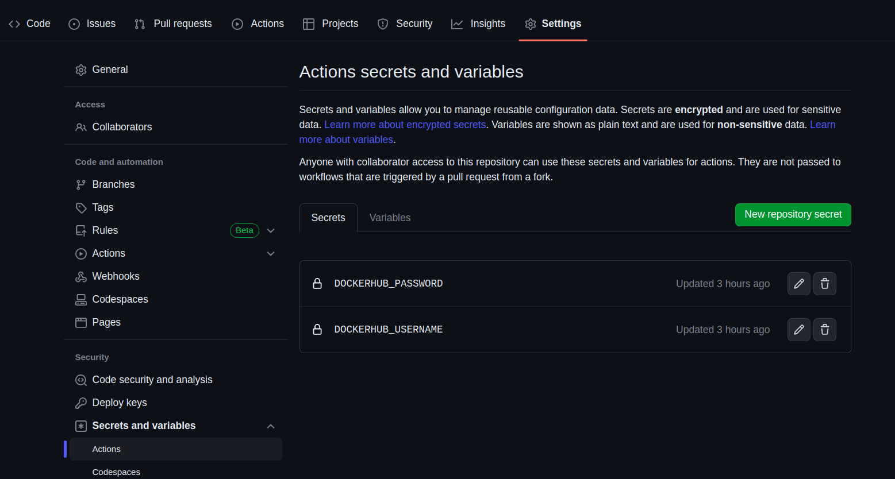
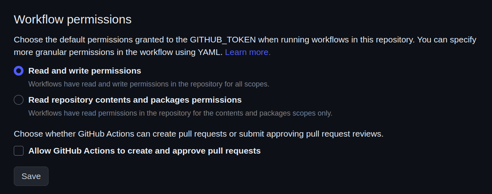
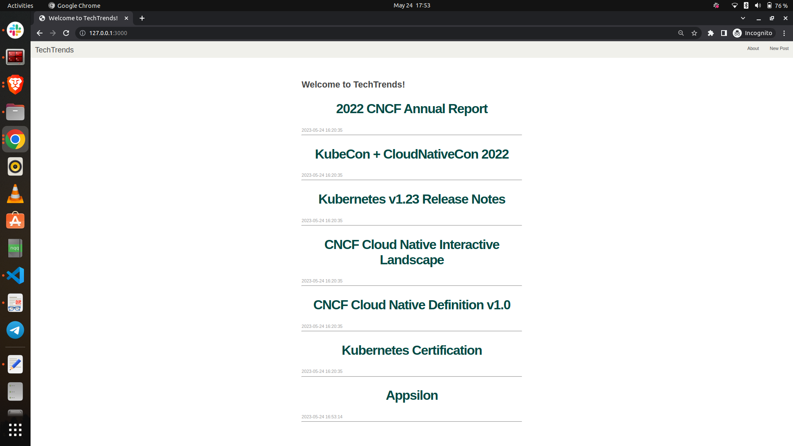

# Containers

## Application file structure
```
.
├── app
│   ├── app.py
│   ├── Dockerfile
│   ├── init_db.py
│   ├── __init__.py
│   ├── requirements.txt
│   ├── schema.sql
│   ├── static
│   │   └── css
│   │       └── main.css
│   └── templates
│       ├── 404.html
│       ├── about.html
│       ├── base.html
│       ├── create.html
│       ├── index.html
│       └── post.html
├── images
│   ├── actions_workflow.png
│   ├── container_running_locally.png
│   └── dockerhub_secrets.png
└── README.md
```

## Prerequisites
- Install [docker](https://docs.docker.com/engine/install/)
- Install [python3](https://www.python.org/downloads/)
- Create [docker hub account](https://hub.docker.com/signup)

At time of this writing, the following versions were used:
- docker v20.10.21
- Python v3.10.9

## CI Build Preparation
- Navigate to the application repository, `https://github.com/Wach-E/appsilon-project` and create a fork of it.
- Navigate to `https://github.com/${your_github_username}/appsilon-project/settings/secrets/actions`.
    - Create a secret named `DOCKERHUB_USERNAME` with value as your dockerhub username.
    - Create a secret named `DOCKERHUB_PASSWORD` with value as your dockerhub password.



- Navigate to `https://github.com/${your_github_username}/appsilon-project/settings/actions`
    - In the **Workflow permissions** section, select  *read and write access for all scopes*. (See [Documentation](https://docs.github.com/en/repositories/managing-your-repositorys-settings-and-features/enabling-features-for-your-repository/managing-github-actions-settings-for-a-repository))



## Local docker build steps
- Clone the forked application repository
```
git clone https://github.com/${your_github_username}/appsilon-project.git
```
- Navigate to the directory containing the Dockerfile for the application
```
$ cd appsilon-project/containers_ci-cd/app
```
- Locally build the docker image for linux
```
$ docker build --platform linux/amd64 -t appsilon .
```
- Run the newly built docker image
```
$ docker run --name app -p 3000:3000 appsilon
```
- Navigate to your browser and enter `localhost:3000` or `127.0.0.1:3000` to see the running container application



The above steps are performed when you wish to build and test local changes. When this is required to be performed in an automated manner, a push to the main branch of the application repository will trigger the [application.yaml](.github/workflows/application.yml) CI workflow. The workflow will also be triggered every saturday at 7pm UTC (19:00).

**Follow-up**: 
Considering the actual pattern when working with dynamic teams is to integrate valid changes from branches via pull-requests, the below snippet could be added to the `application.yml` file.

```
on:
  ...
  pull_request:
    branches: [main]
  ...
```


